# ReAct Agent Architecture Diagrams

## 1. ReAct Agent Flow


---

## 2. Detailed ReAct Loop (One Iteration)


---

## 3. Available Tools


---

## 4. Metric Reflection & Root Cause Analysis

```mermaid
flowchart TD
    Start[Detect Metric Pattern] --> Pattern{Pattern Type?}
    
    Pattern -->|Conflicting| Conflict[Example:<br/>HQDR ↑ but MAU ↓]
    Pattern -->|Unexpected| Unexpected[Example:<br/>Metric opposite of<br/>desired direction]
    Pattern -->|Large Movement| Large[Example:<br/>Impact > 10%]
    
    Conflict --> Reflect[REFLECTION PHASE]
    Unexpected --> Reflect
    Large --> Reflect
    
    Reflect --> Context1[Get Experiment Brief]
    Context1 --> Q1{What is the<br/>feature doing?}
    
    Q1 --> Context2[Get Metric Definitions]
    Context2 --> Q2{How are these<br/>metrics calculated?}
    
    Q2 --> Context3[Get Source SQL]
    Context3 --> Q3{What data sources<br/>are used?}
    
    Q3 --> Analyze[Analyze Patterns]
    
    Analyze --> Hypothesize[Generate Hypotheses]
    
    Hypothesize --> H1[Hypothesis 1:<br/>Added Friction]
    Hypothesize --> H2[Hypothesis 2:<br/>Quality vs Quantity]
    Hypothesize --> H3[Hypothesis 3:<br/>Segment Shift]
    Hypothesize --> H4[Hypothesis 4:<br/>Data Quality]
    Hypothesize --> H5[Hypothesis 5:<br/>Seasonal Effect]
    
    H1 --> Evidence[Look for Supporting<br/>Evidence in Data]
    H2 --> Evidence
    H3 --> Evidence
    H4 --> Evidence
    H5 --> Evidence
    
    Evidence --> Check1{Check related<br/>metrics}
    Check1 --> Check2{Check dimensional<br/>breakdowns}
    Check2 --> Check3{Check temporal<br/>patterns}
    
    Check3 --> Conclusion[Synthesize Findings]
    
    Conclusion --> Output[Output:<br/>- Likely causes<br/>- Supporting evidence<br/>- Recommended investigation]
    
    style Reflect fill:#fff3cd
    style Hypothesize fill:#f8d7da
    style Evidence fill:#d1ecf1
    style Output fill:#d4edda
```



### Example Reflection Process:

**Observation:** HQDR improving (+5%) but MAU decreasing (-2%)

**Reflection Steps:**

1. **Get Context:**
   - Brief: "Increase friction before checkout if NUX has a risky address"
   - HQDR definition: High Quality Delivery Rate (successful deliveries / total deliveries)
   - MAU definition: Monthly Active Users (unique users placing orders)

2. **Understand Metrics:**
   - HQDR source SQL: `SELECT COUNT(DISTINCT successful_deliveries) / COUNT(DISTINCT deliveries)`
   - MAU source SQL: `SELECT COUNT(DISTINCT user_id) FROM orders WHERE date >= date - 30`

3. **Generate Hypotheses:**
   - **H1: Added friction reduces bad actors** → HQDR ↑ (fewer failed deliveries)
   - **H2: Friction deters some legitimate users** → MAU ↓ (fewer users completing orders)
   - **H3: Quality vs quantity tradeoff** → Feature working as intended
   - **H4: Segment shift** → Losing low-intent users, keeping high-intent users
   - **H5: User experience degradation** → Friction too aggressive

4. **Look for Evidence:**
   - Check: `new_vs_existing_user` dimension → Is MAU drop in new or existing?
   - Check: `orders_per_active_user` → Are remaining users ordering more?
   - Check: `cart_abandonment_rate` → Did friction cause abandonment?
   - Check: `error_rate` by address type → Which addresses are blocked?

5. **Synthesize:**
   ```
   Most Likely: H3 (Quality vs Quantity Tradeoff)
   
   Evidence:
   - HQDR up 5% (fewer bad addresses getting through)
   - MAU down 2% (some users blocked or deterred)
   - MAU drop concentrated in new_users (-4%) vs existing (+1%)
   - Orders per active user up +2% (higher intent users remain)
   
   Interpretation: Feature is filtering out low-quality users (likely fraud/bad addresses)
   while retaining legitimate customers. The MAU drop is acceptable given HQDR improvement.
   
   Recommendation: Continue experiment. Monitor that MAU stabilizes and doesn't continue dropping.
   ```

---

## 5. Tool Dependency & Usage Flow (Updated with Reflection)


---

## 5. Tool Details


---

## 6. Rules Enforcement

```mermaid
flowchart TD
    subgraph "System Prompt Rules (Soft)"
        R1[Check primary first]
        R2[Then secondary]
        R3[Then guardrails]
        R4[Use minimal emoji]
        R5[Deep dive if impact > 5%]
    end
    
    subgraph "Tool Implementation Rules (Hard)"
        R6[Guardrails: ONLY sig negative]
        R7[Dimension: overall first]
        R8[Sort by impact magnitude]
    end
    
    subgraph "Agent Loop Rules (Enforced)"
        R9[Max 20 iterations]
        R10[Max 30 tool calls]
        R11[Timeout after 300s]
    end
    
    subgraph "Output Validation Rules (Check)"
        R12[Emoji count ≤ 3]
        R13[Has recommendations]
        R14[Includes all metric types]
    end
    
    LLM[LLM Execution] --> R1
    LLM --> R2
    LLM --> R3
    LLM --> R4
    LLM --> R5
    
    Tool[Tool Execution] --> R6
    Tool --> R7
    Tool --> R8
    
    Loop[Agent Loop] --> R9
    Loop --> R10
    Loop --> R11
    
    Output[Final Output] --> R12
    Output --> R13
    Output --> R14
    
    style R1 fill:#e7f3ff
    style R2 fill:#e7f3ff
    style R3 fill:#e7f3ff
    style R4 fill:#e7f3ff
    style R5 fill:#e7f3ff
    
    style R6 fill:#fff3e0
    style R7 fill:#fff3e0
    style R8 fill:#fff3e0
    
    style R9 fill:#ffe7e7
    style R10 fill:#ffe7e7
    style R11 fill:#ffe7e7
    
    style R12 fill:#e8f5e9
    style R13 fill:#e8f5e9
    style R14 fill:#e8f5e9
```



---

## 7. Complete System Architecture


---

## Key Takeaways

### ReAct Pattern = 3 Steps Repeated:
1. **REASON** - LLM thinks about what to do next
2. **ACT** - LLM calls a tool
3. **OBSERVE** - Tool result added to context

### Tools = Python Functions:
- No special framework needed
- Just regular Python code
- Return strings (LLM reads them)

### Rules = Multiple Layers:
- System prompt (guidance)
- Tool code (enforcement)
- Validation (quality check)

---

## 8. Reflection Tools & Implementation

### New Tool 1: get_metric_correlations

```mermaid
flowchart LR
    Input[Input:<br/>analysis_id<br/>primary_metric] --> Query[Query all metrics<br/>for analysis]
    Query --> Compare[Compare movements<br/>across metrics]
    Compare --> Patterns{Identify Patterns}
    
    Patterns --> P1[Both metrics ↑<br/>Aligned growth]
    Patterns --> P2[Metric A ↑<br/>Metric B ↓<br/>Tradeoff pattern]
    Patterns --> P3[Leading indicators<br/>Funnel relationships]
    
    P1 --> Output[Output:<br/>Correlated metrics<br/>with interpretations]
    P2 --> Output
    P3 --> Output
```


**Use Case:** Find related metric movements to understand full picture

---

### New Tool 2: reflect_on_metrics

```mermaid
flowchart TD
    Input[Input:<br/>Conflicting metrics<br/>e.g. HQDR ↑, MAU ↓] --> GetContext[Get ALL Context]
    
    GetContext --> C1[Experiment Brief:<br/>What is the feature?]
    GetContext --> C2[Metric Definitions:<br/>How calculated?]
    GetContext --> C3[Source SQL:<br/>What data?]
    GetContext --> C4[Dimensional Data:<br/>Which segments?]
    
    C1 --> Synthesize[Synthesize Context]
    C2 --> Synthesize
    C3 --> Synthesize
    C4 --> Synthesize
    
    Synthesize --> Generate[Generate Hypotheses]
    
    Generate --> H1["Hypothesis 1: Friction Effect<br/>Feature adds friction → deters some users<br/>Evidence: Check cart_abandonment"]
    Generate --> H2["Hypothesis 2: Quality Filter<br/>Feature filters bad actors → fewer users but better quality<br/>Evidence: Check orders_per_user, error_rate"]
    Generate --> H3["Hypothesis 3: Segment Shift<br/>Losing low-intent users, keeping high-intent<br/>Evidence: Check new_vs_existing breakdown"]
    Generate --> H4["Hypothesis 4: Metric Definition<br/>Metrics measuring different populations<br/>Evidence: Check metric source SQL overlap"]
    Generate --> H5["Hypothesis 5: Data Quality<br/>Tracking or logging issue<br/>Evidence: Check sample sizes, null rates"]
    Generate --> H6["Hypothesis 6: Temporal Effect<br/>Day-of-week or seasonal pattern<br/>Evidence: Check historical trends"]
    
    H1 --> Evidence[Look for Evidence<br/>in Available Data]
    H2 --> Evidence
    H3 --> Evidence
    H4 --> Evidence
    H5 --> Evidence
    H6 --> Evidence
    
    Evidence --> Query1[Query related metrics]
    Evidence --> Query2[Query dimensional cuts]
    Evidence --> Query3[Compare metric definitions]
    
    Query1 --> Rank[Rank Hypotheses<br/>by Evidence Strength]
    Query2 --> Rank
    Query3 --> Rank
    
    Rank --> Output[Output:<br/>- Most likely causes<br/>- Supporting evidence<br/>- Investigation steps]
    
    style Input fill:#ffe7e7
    style Generate fill:#fff3cd
    style Evidence fill:#d1ecf1
    style Output fill:#d4edda
```


---

### Example: HQDR ↑ but MAU ↓ Reflection

**Agent Reasoning Process:**

```
1. DETECT PATTERN:
   - HQDR (High Quality Delivery Rate): +5.2% (p=0.008)
   - MAU (Monthly Active Users): -2.1% (p=0.041)
   - Pattern: Quality ↑ but Volume ↓ (potential tradeoff)

2. GET CONTEXT:
   Tool: get_experiment_brief()
   Result: "Feature adds friction before checkout for risky addresses"
   
   Tool: get_metric_definition("HQDR")
   Result: "successful_deliveries / total_deliveries"
   
   Tool: get_metric_definition("MAU")
   Result: "COUNT(DISTINCT user_id) from orders WHERE date >= date-30"
   
   Tool: find_source_sql("HQDR_measure_id")
   Result: "FROM delivery_outcomes WHERE status = 'completed'"
   
   Tool: find_source_sql("MAU_measure_id")
   Result: "FROM orders WHERE order_status IN ('completed', 'pending')"

3. GENERATE HYPOTHESES:
   
   Hypothesis 1: Friction Effect (Likelihood: 60%)
   - Feature adds validation → some users drop off
   - Evidence needed: cart_abandonment_rate, checkout_start_rate
   
   Hypothesis 2: Quality Filter (Likelihood: 80%)
   - Feature blocks bad addresses → fewer failed deliveries (HQDR ↑)
   - Also blocks some legitimate users with risky-looking addresses (MAU ↓)
   - Evidence needed: blocked_address_count, error_rate
   
   Hypothesis 3: Segment Shift (Likelihood: 70%)
   - Losing fraud/low-quality users → MAU ↓
   - Keeping legitimate users → HQDR ↑
   - Evidence needed: new_vs_existing breakdown, orders_per_user
   
   Hypothesis 4: Metric Population Mismatch (Likelihood: 30%)
   - HQDR measures completed deliveries
   - MAU measures order attempts (includes blocked)
   - Different denominators could explain pattern
   - Evidence needed: Review metric source SQL overlap
   
   Hypothesis 5: Data Quality Issue (Likelihood: 10%)
   - Tracking event dropped for MAU
   - Evidence needed: Sample size check, null rate

4. LOOK FOR EVIDENCE:
   
   Tool: get_metric_correlations(analysis_id)
   Results:
   - cart_abandonment_rate: -1.2% (p=0.32) - flat
   - orders_per_active_user: +3.1% (p=0.019) - sig positive ✓
   - new_user_orders: -5.1% (p=0.008) - sig negative ✓
   - existing_user_orders: +1.2% (p=0.45) - flat
   
   Tool: query_snowflake("SELECT dimension breakdown...")
   Results:
   - MAU (new_users): -4.2% (p=0.01) - sig negative ✓
   - MAU (existing_users): +0.8% (p=0.61) - flat
   - HQDR (new_users): +6.1% (p=0.003) - sig positive ✓
   - HQDR (existing_users): +4.8% (p=0.012) - sig positive ✓

5. RANK HYPOTHESES BY EVIDENCE:
   
   🥇 Hypothesis 2 (Quality Filter) - 90% confidence
   Evidence:
   ✓ orders_per_active_user UP (+3.1%) → remaining users are higher quality
   ✓ MAU drop concentrated in new_users (-4.2%) → filtering out bad actors
   ✓ HQDR up in both segments → fewer failed deliveries across board
   
   🥈 Hypothesis 3 (Segment Shift) - 85% confidence
   Evidence:
   ✓ new_user metrics down, existing_user metrics stable → segment effect
   ✓ Aligns with feature intent (block risky addresses more common in new users)
   
   🥉 Hypothesis 1 (Friction Effect) - 40% confidence
   Evidence:
   ✗ cart_abandonment_rate flat (-1.2%, p=0.32) → friction not causing abandonment
   
   ❌ Hypothesis 4 (Metric Mismatch) - 15% confidence
   ❌ Hypothesis 5 (Data Quality) - 5% confidence

6. SYNTHESIZE CONCLUSION:

   Most Likely Explanation:
   Feature is working as designed - filtering out low-quality users (primarily new users
   with risky addresses) while maintaining delivery quality. The MAU decrease is concentrated
   in new users (-4.2%) who are more likely to have bad addresses, while existing users
   are unaffected (+0.8%). The increase in orders_per_active_user (+3.1%) suggests the
   remaining user base is higher intent.
   
   This is a POSITIVE signal - quality over quantity tradeoff working correctly.
   
   Recommended Investigation:
   1. Confirm blocked addresses are indeed risky (check historical error rates)
   2. Monitor that MAU stabilizes (ensure not losing too many legitimate users)
   3. Check if HQDR improvement sustains as experiment scales
```

---

## 6. New Tools for Reflection

### Tool 7: get_experiment_brief
```python
{
    "name": "get_experiment_brief",
    "description": """Get experiment context from Coda table.
    
    Returns:
    - brief_summary: Feature description
    - details: Additional context
    - project_name: Experiment name
    
    Use this to understand WHAT the feature does and WHY it exists.""",
    "parameters": {
        "type": "object",
        "properties": {
            "project_name": {
                "type": "string",
                "description": "Experiment project name"
            }
        },
        "required": ["project_name"]
    }
}
```

**Implementation:**
```python
def get_experiment_brief(self, project_name: str) -> str:
    query = f"""
    SELECT 
        project_name,
        brief_summary,
        details,
        brief as brief_doc_link
    FROM proddb.fionafan.coda_experiments_focused
    WHERE project_name = '{project_name}'
      AND view_name = 'Live Experiments'
    LIMIT 1
    """
    # Returns markdown with feature description
```

---

### Tool 8: get_metric_definition
```python
{
    "name": "get_metric_definition",
    "description": """Get complete metric definition including description and spec.
    
    Returns:
    - Metric description (what it measures)
    - Metric spec (how it's calculated)
    - Desired direction
    
    Use this to understand HOW a metric is calculated.""",
    "parameters": {
        "type": "object",
        "properties": {
            "metric_name": {
                "type": "string",
                "description": "Name of the metric (e.g., 'checkout_conversion')"
            }
        },
        "required": ["metric_name"]
    }
}
```

**Implementation:**
```python
def get_metric_definition(self, metric_name: str) -> str:
    query = f"""
    SELECT 
        name,
        description,
        spec,
        desired_direction
    FROM CONFIGURATOR_PROD.PUBLIC.TALLEYRAND_METRICS
    WHERE name = '{metric_name}'
    """
    # Returns metric definition + spec JSON
```

---

### Tool 9: get_metric_correlations
```python
{
    "name": "get_metric_correlations",
    "description": """Get all metrics for an analysis to identify patterns.
    
    Returns all metrics (significant and non-significant) to help identify:
    - Correlated movements (both metrics moving together)
    - Tradeoff patterns (one up, one down)
    - Leading/lagging indicators (funnel relationships)
    
    Use this when you see conflicting or unexpected metric patterns.""",
    "parameters": {
        "type": "object",
        "properties": {
            "analysis_id": {
                "type": "string",
                "description": "Curie analysis ID"
            },
            "dimension_cut": {
                "type": "string",
                "description": "Dimension cut (default: overall)"
            }
        },
        "required": ["analysis_id"]
    }
}
```

**Implementation:**
```python
def get_metric_correlations(self, analysis_id: str, dimension_cut: str = "overall") -> str:
    query = f"""
    SELECT 
        metric_name,
        metric_type,
        metric_impact_relative,
        p_value,
        stat_sig,
        metric_description
    FROM proddb.fionafan.nux_curie_result_daily
    WHERE analysis_id = '{analysis_id}'
      AND dimension_cut_name = '{dimension_cut}'
    ORDER BY metric_type, metric_name
    """
    # Returns full metric landscape for pattern analysis
```

---

## 7. Reflection Output Example

When the agent detects HQDR ↑ but MAU ↓, the callout includes:

```markdown
## Block bad address at checkout

**Feature:** Increase friction before checkout if NUX has a risky address

### Significant Metrics
- **HQDR (High Quality Delivery Rate):** +5.2% (p=0.008) - sig positive
- **MAU (Monthly Active Users):** -2.1% (p=0.041) - sig negative

### Reflection: Why is HQDR improving while MAU decreases?

**Pattern Detected:** Quality vs Quantity Tradeoff

**Context:**
- Feature adds address validation before checkout
- HQDR = successful_deliveries / total_deliveries
- MAU = distinct users placing orders in 30 days

**Analysis:**
The feature is working as designed - filtering risky addresses improves delivery
success rate but reduces total user count. This appears to be the intended tradeoff.

**Likely Causes (ranked by evidence):**

1. **Quality Filter Effect** (Confidence: 90%)
   - Feature blocks bad/risky addresses → HQDR improves
   - Some users deterred by validation → MAU decreases
   - Evidence:
     * orders_per_active_user: +3.1% (p=0.019) ✓
     * MAU drop concentrated in new_users: -4.2% vs existing: +0.8% ✓
     * HQDR improvement in both segments ✓

2. **Segment Shift** (Confidence: 85%)
   - Losing low-intent/fraud users (likely bad addresses)
   - Retaining high-intent legitimate users
   - Evidence:
     * New user orders down -5.1%, existing stable ✓
     * Order quality metrics all improved ✓

3. **Friction Deterrence** (Confidence: 40%)
   - Validation step creates friction
   - Evidence:
     * cart_abandonment_rate flat (-1.2%, p=0.32) ✗
     * Suggests friction is minimal

**Dimensional Breakdown:**
| Segment | HQDR Impact | MAU Impact | Interpretation |
|---------|-------------|------------|----------------|
| New users | +6.1% | -4.2% | Filtering new bad addresses |
| Existing users | +4.8% | +0.8% | Minimal impact on loyal users |

**Interpretation:**
This is a **positive outcome**. The feature successfully filters bad addresses
(HQDR ↑) while the MAU impact is concentrated in likely-fraudulent new users.
The fact that existing users are unaffected (+0.8%) and orders_per_user increased
(+3.1%) indicates we're removing low-quality traffic, not deterring legitimate customers.

### Recommendation
✅ Continue ramping. The metrics show the intended quality/quantity tradeoff.
Monitor that:
1. MAU stabilizes (doesn't continue dropping)
2. Existing user metrics remain stable
3. HQDR improvement sustains

### Investigation Steps (Optional):
- Check blocked address error rates historically
- Validate fraud rate in blocked segment
- Ensure validation UI is clear (minimize legitimate user confusion)
```

---

## 9. When Reflection is Triggered

```mermaid
flowchart TD
    Metrics[Agent Observes<br/>Metric Movements] --> Check1{Conflicting<br/>patterns?}
    
    Check1 -->|Yes| Examples1["Example:<br/>HQDR ↑ but MAU ↓<br/>CTR ↑ but Conversion ↓"]
    Examples1 --> Trigger
    
    Check1 -->|No| Check2{Unexpected<br/>direction?}
    
    Check2 -->|Yes| Examples2["Example:<br/>Desired: ↑<br/>Actual: ↓ sig negative"]
    Examples2 --> Trigger
    
    Check2 -->|No| Check3{Very large<br/>movement?}
    
    Check3 -->|Yes| Examples3["Example:<br/>Impact > 10%<br/>OR p < 0.001"]
    Examples3 --> Trigger
    
    Check3 -->|No| Skip[Skip Reflection<br/>Standard analysis only]
    
    Trigger[TRIGGER REFLECTION] --> Tools[Use Reflection Tools]
    
    Tools --> T1[get_experiment_brief]
    Tools --> T2[get_metric_definition]
    Tools --> T3[find_source_sql]
    Tools --> T4[get_metric_correlations]
    
    T1 --> Generate[Generate Hypotheses]
    T2 --> Generate
    T3 --> Generate
    T4 --> Generate
    
    Generate --> Investigate[List Investigation Steps]
    
    style Trigger fill:#ffe7e7
    style Generate fill:#fff3cd
    style Investigate fill:#d4edda
```



---

## 10. Complete Tool Catalog (8 Tools)

| Tool | Purpose | When to Use | Data Source |
|------|---------|-------------|-------------|
| **get_live_experiments** | Get experiment list | Always (first step) | coda_experiments_focused |
| **get_significant_metrics** | Get significant movements | For each experiment | nux_curie_result_daily |
| **get_all_metrics_for_analysis** | Get ALL metrics sorted by impact | Pattern detection, reflection | nux_curie_result_daily |
| **parse_metric_spec** | Understand calculation | Large impact (>5%) | Uses metric_spec column |
| **find_source_sql** | Get data source SQL | Unexpected behavior | TALLEYRAND_SOURCE |
| **query_snowflake** | Custom queries | Ad-hoc analysis | Any Snowflake table |
| **get_experiment_brief** | Get feature description | For reflection | coda_experiments_focused |
| **get_metric_definition** | Get metric details | For reflection | TALLEYRAND_METRICS |

---

**Updated architecture now includes intelligent reflection!** The agent can reason about WHY metrics show unexpected patterns.

